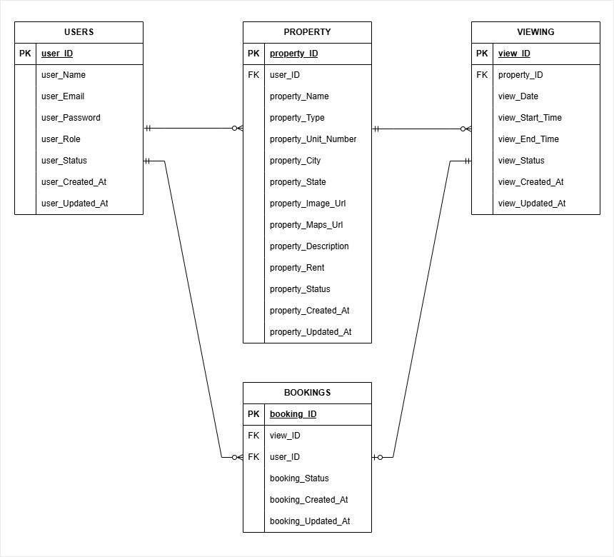
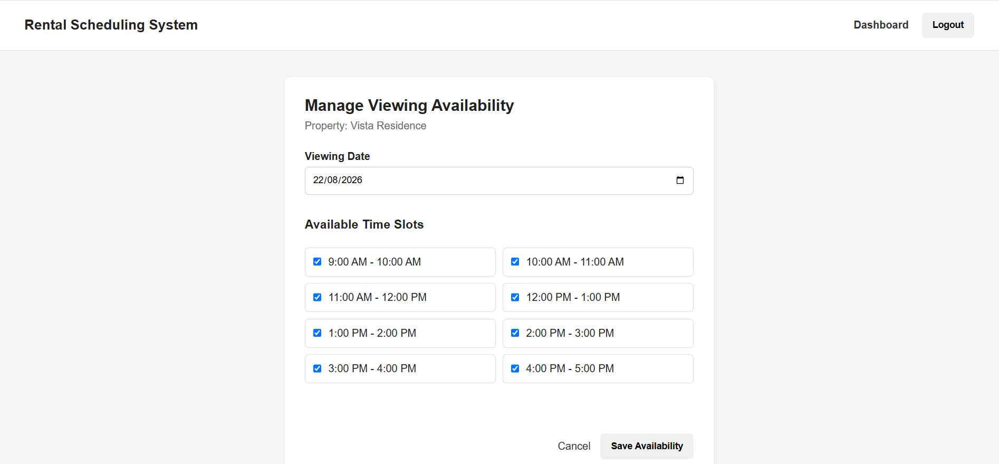
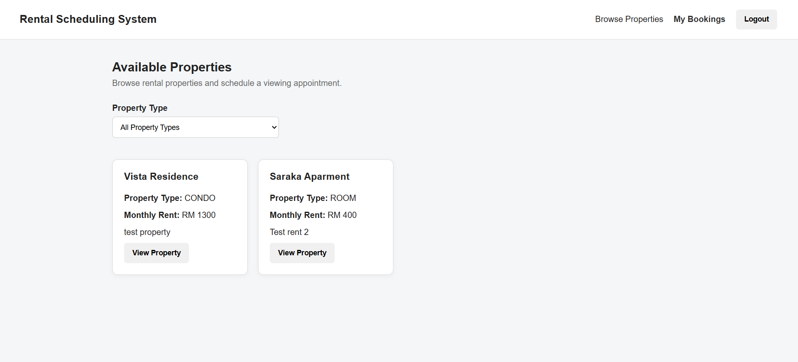
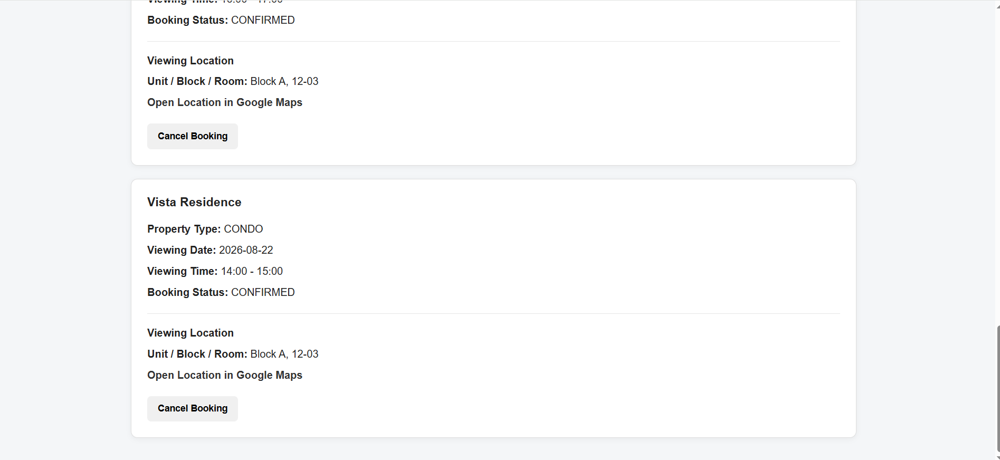
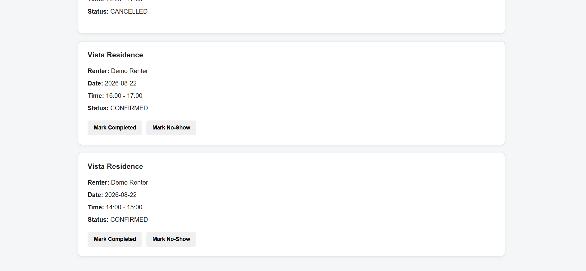

# Rental Scheduling System
Description: A rental viewing scheduling system designed to reduce communication friction between property owners and potential renters.

## Project Status
Current phase: Application Development
Version: v0.2.4
Last updated: 22 August 2026

### Changelog

#### v0.2.4 — 22 August 2026
- Add property.State
- Add property.City
- Created the PROPERTY, VIEWING, and BOOKINGS database table based on the updated ERD design.
- Connected renter property browsing and viewing availability to MySQL.
- Implemented transactional viewing booking.
- Added renter booking history and confirmed-location details.
- Added 24-hour booking cancellation rule and slot reopening.
- Added owner booking management with completed and no-show statuses.
- Added logged-in user name display.

#### v0.2.3 — 22 August 2026
- Initialized Node.js and Express backend.
- Connected the backend to the XAMPP MySQL database.
- Created the USERS database table based on the existing ERD design.
- Implemented database-backed user registration with password hashing.
- Implemented user login with credential validation.
- Added role-based routing for OWNER and RENTER users.
- Added basic logout functionality using session storage.

#### v0.2.2 — 20 August 2026
- Update Booking Management Rules
- Update Viewing Management RulesA
- Update Owner dashboard interface
- Add Renter dashboard interface
- Add Property listing interface
- Add Booking confirmation interface
- Add functional prototype screenshots demonstrating the current system flow

#### v0.2.1 — 18 August 2026
- Update System Rules
- Add Owner dashboard interface
- Add Property interface

#### v0.2.0 — 17 August 2026
- Update System Rules
- Add Database Design
- Add Login interface & Register interface

#### v0.1.2 — 06 August 2026
- Define MVP Scope
- Update System Rules
- Update Future Improvement
- Define Design Decision

#### v0.1.1 — 05 August 2026
- Define User Roles
- Define System Rules
- Add Project Goals
- Define Future Improvements

#### v0.1.0 — 04 August 2026
- Created project roadmap
- Drafted README structure
- Identify Problem Statement

#### v0.0.1 — 03 August 2026
- Repository initialized
- Initial project planning

## Development Roadmap

Milestone 1:
Project Planning & Requirements

Milestone 2:
Prototype Design

Milestone 3:
Logic Validation

Milestone 4:
Application Development

Milestone 5:
Testing & Refinement

Milestone 6:
Deployment & Presentation

## Project Overview
Rental Scheduling System helps property owners manage rental unit viewing availability while allowing renters to directly select and book suitable viewing time slots.

The system aims to reduce the manual coordination usually required between owners and renters, such as negotiating viewing times, confirming appointments, and sharing viewing details.

## Problem Statement
Arranging rental property viewings often depends on manual communication between property owners and potential renters.

The current process creates several problems:

* Renters may need to wait hours for replies before confirming a viewing.
* Owners need to repeatedly answer similar questions about availability and location.
* Managing multiple interested renters becomes difficult.
* Managing multiple rental units increases scheduling complexity.

This becomes inefficient when every viewing requires individual coordination.

## Project Goals
Create a viewing scheduling system that allows:

### Property Owners
* Create and manage rental property listings.
* Define available viewing schedules.
* Reduce repetitive communication with renters.
* Track viewing appointments and outcomes.

### Renters
* Browse available rental properties.
* View available viewing slots.
* Book suitable viewing times immediately.
* Receive necessary viewing information after confirmation.

## User Roles
The system uses role-based accounts.

## Property Owner
Owners can:
* Create rental property listings.
* Configure recurring viewing availability.
* Manage viewing appointments.
* Update viewing outcomes.

## Renter
Renters can:
* Browse available properties.
* Select available viewing slots.
* Manage their bookings.
* Access viewing details after confirmation.

## MVP Scope
*Objective:*
Allow property owners and renters to complete the rental viewing process digitally.

## Property Owner MVP

The owner can:
### Property Management
* Create property listings.
* Update property information.
* Manage their own properties.

### Viewing Management
* Configure available viewing times.
* Create recurring viewing schedules.
* View upcoming appointments.
* Update viewing outcomes.

## Renter MVP
The renter can:

### Property Discovery
* Browse available properties.
* View property details.

### Viewing Booking
* View available viewing slots.
* Select a viewing slot.
* Confirm a booking.
* View booking details.
* Cancel a booking.

## System Design

## Feature: Authentication & Authorization

### Feature Rules
* Users must authenticate before accessing protected features.
* Each user has a role (Owner or Renter).
* Users can only access functions allowed by their role.

### Design Decision
* Role-based access control (RBAC) is used to separate owner and renter permissions.

### Future Improvement
* Social login.
* Two-factor authentication.
* Passwordless login.

## Platform Decision :Web Application
Although a mobile application may provide a better experience, the first version focuses on a web application.

### Design Decision 
* Faster development cycle
* Easier testing and iteration
* Focus on validating core scheduling logic
* Avoid unnecessary platform complexity during MVP stage

### Future Improvement: Mobile Application
A mobile application is planned as a future enhancement to improve user convenience through:
* Push notifications
* Mobile-first viewing experience
* Easier appointment management
* Integrated navigation features

## Feature: Viewing Management
### Feature Rules
* Each viewing slot belongs to one property.
* A viewing slot has an availability status.
* Owners can only create viewing availability for the current date or future dates.
* Viewing availability cannot be created for past dates.
* A slot can only have one active booking.
* Once booked, the slot becomes unavailable.
* Cancelled bookings may release the slot based on cancellation rules.

### Design Decision
* Use separate Viewing and Booking concepts.
* Viewing represents *availability*.
* Booking represents *reservation history*.

Reason:
* Prevents mixing availability management with transaction history.

### Future Improvement
* Add calendar synchronization.
* Allow owners to block specific dates.

## Feature: Booking Management
### Feature Rules
* Renters can only book available slots.
* Renters can only select viewing dates from the current date onward.
* Past viewing dates cannot be selected for new bookings.
* A booking has statuses:
  * Confirmed
  * Cancelled
  * Completed
* If a booking is cancelled more than 24 hours before viewing, the slot becomes available again.
* A booking cannot be cancelled if less than 24 hours before viewing.

### Design Decision
* Keep cancelled bookings instead of deleting them.
* Avoid renters cancel booking last minute. 

Reason:
* Maintains booking history and improves tracking.
* Avoid renters block the viewing slot from another renters. 

### Future Improvement
* Rescheduling workflow.
* Automated reminders.
* Waitlist system.

## Feature: Account Rules
### Feature Rules
* Each account is registered as either a Property Owner or Renter.
* Account roles are determined during registration.
* Account roles cannot be changed after registration.
* Users requiring another role must create a separate account.

### Design Decisions
* to maintain individual dashboard for a Property Owner or Renter.

### Future Improvements
* Support multi-role accounts where users can act as both property owners and renters.

### Database Design

The initial database design consists of four core entities: Users, Property, Viewing, and Bookings.

### Core Tables

- **Users** – Stores account and role information.
- **Properties** – Stores rental properties belonging to owners.
- **Viewing Slots** – Stores available viewing dates and times.
- **Bookings** – Connects renters with selected viewing slots.

### USERS Table
| Attribute | Type | Key | Description |
|---|---|---|---|
| user_ID | INT | PK | Unique user identifier |
| user_Name | VARCHAR(100) | | User's name |
| user_Email | VARCHAR(255) | UNIQUE | User's email address |
| user_Password_Hash | VARCHAR(255) | | Hashed user password |
| user_Role | VARCHAR(20) | | OWNER or RENTER |
| user_Status | VARCHAR(20) | | ACTIVE or INACTIVE |
| user_Created_At | TIMESTAMP | | Account creation timestamp |
| user_Updated_At | TIMESTAMP | | Last account update |

---

### PROPERTY Table
| Attribute | Type | Key | Description |
|---|---|---|---|
| property_ID | INT | PK | Unique property identifier |
| user_ID | INT | FK | References Users.user_ID |
| property_Name | VARCHAR(150) | | Property/listing name |
| property_Type | VARCHAR(30) | | ROOM, APARTMENT, CONDO, or HOUSE |
| property_Unit | VARCHAR(50) | | Unit/block/room information |
| property_City | VARCHAR(100) | | City or locality of the property |
| property_State | VARCHAR(100) | | State or federal territory of the property |
| property_GMap_URL | VARCHAR(255) | | Google Maps location URL |
| property_Image_URL | VARCHAR(255) | | Property image path or URL |
| property_Description | TEXT | | Property description |
| property_Rent | DECIMAL(10,2) | | Monthly rental price |
| property_Status | VARCHAR(20) | | AVAILABLE, RENTED, or HIDDEN |
| property_Created_At | TIMESTAMP | | Property creation timestamp |
| property_Updated_At | TIMESTAMP | | Last property update |

### VIEWING Table
| Attribute | Type | Key | Description |
|---|---|---|---|
| view_ID | INT | PK | Unique viewing slot identifier |
| property_ID | INT | FK | References Property.property_ID |
| view_Date | DATE | | Viewing date |
| view_Start_Time | TIME | | Start of predefined one-hour slot |
| view_End_Time | TIME | | End of predefined one-hour slot |
| view_Status | VARCHAR(20) | | AVAILABLE, BOOKED, or UNAVAILABLE |
| view_Created_At | TIMESTAMP | | Slot creation timestamp |
| view_Updated_At | TIMESTAMP | | Last slot update |

---

### BOOKING Table
| Attribute | Type | Key | Description |
|---|---|---|---|
| booking_ID | INT | PK | Unique booking identifier |
| view_ID | INT | FK | References Viewing.view_ID |
| user_ID | INT | FK | References renter in Users.user_ID |
| booking_Status | VARCHAR(20) | | CONFIRMED, CANCELLED, COMPLETED, or NO_SHOW |
| booking_Created_At | TIMESTAMP | | Booking creation timestamp |
| booking_Updated_At | TIMESTAMP | | Last booking update |

---

## Functional Prototype

The current prototype demonstrates the core rental viewing
scheduling workflow using HTML, CSS, JavaScript, and localStorage.

### Owner — Manage Viewing Availability

### Renter — Browse Available Properties

### Renter — Booking Management

### Owner — Manage Bookings

