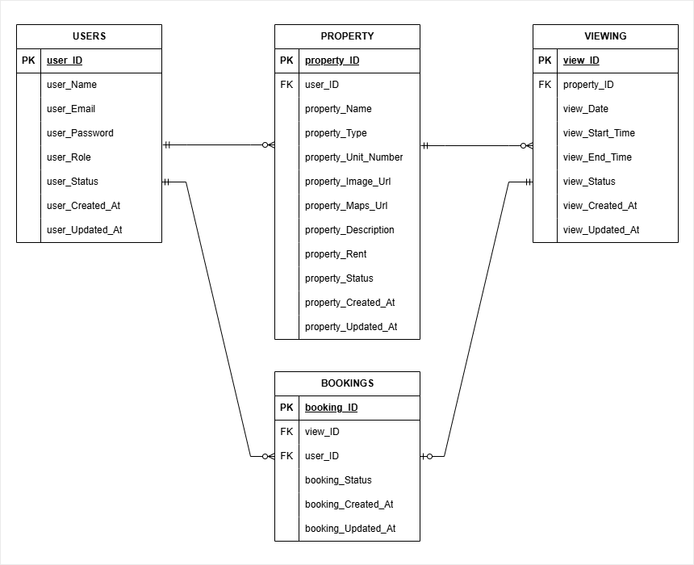

# Rental Viewing Schedule
Description: A rental viewing scheduling system designed to reduce communication friction between property owners and potential renters.

## Project Status
Current phase: Prototype Design
Version: v0.2.0
Last updated: 17 August 2026

### Changelog

#### v0.2.0 — 17 August 2026
- Update System Rules
- Add Database Design
- Add Login interface & Register interface

#### v0.1.2 — 06 August 2026
- Define MVP Scope
- Update System Rules
- Update Future Improvement
- Define Design Decision

#### v0.1.1 — 05 August 2026
- Define User Roles
- Define System Rules
- Add Project Goals
- Define Future Improvements

#### v0.1.0 — 04 August 2026
- Created project roadmap
- Drafted README structure
- Identify Problem Statement

#### v0.0.1 — 03 August 2026
- Repository initialized
- Initial project planning

## Development Roadmap

Milestone 1:
Project Planning & Requirements

Milestone 2:
Prototype Design

Milestone 3:
Logic Validation

Milestone 4:
Application Development

Milestone 5:
Testing & Refinement

Milestone 6:
Deployment & Presentation

---

## Project Overview
Rental Viewing Schedule helps property owners manage rental unit viewing availability while allowing renters to directly select and book suitable viewing time slots.

The system aims to reduce the manual coordination usually required between owners and renters, such as negotiating viewing times, confirming appointments, and sharing viewing details.

---
## Problem Statement
Arranging rental property viewings often depends on manual communication between property owners and potential renters.

The current process creates several problems:

* Renters may need to wait hours for replies before confirming a viewing.
* Owners need to repeatedly answer similar questions about availability and location.
* Managing multiple interested renters becomes difficult.
* Managing multiple rental units increases scheduling complexity.

This becomes inefficient when every viewing requires individual coordination.

---
## Project Goals
Create a viewing scheduling system that allows:

### Property Owners
* Create and manage rental property listings.
* Define available viewing schedules.
* Reduce repetitive communication with renters.
* Track viewing appointments and outcomes.

### Renters
* Browse available rental properties.
* View available viewing slots.
* Book suitable viewing times immediately.
* Receive necessary viewing information after confirmation.

---
## User Roles
The system uses role-based accounts.

## Property Owner
Owners can:
* Create rental property listings.
* Configure recurring viewing availability.
* Manage viewing appointments.
* Update viewing outcomes.

## Renter
Renters can:
* Browse available properties.
* Select available viewing slots.
* Manage their bookings.
* Access viewing details after confirmation.

---
## MVP Scope
*Objective:*
Allow property owners and renters to complete the rental viewing process digitally.

## Property Owner MVP

The owner can:
### Property Management
* Create property listings.
* Update property information.
* Manage their own properties.

### Viewing Management
* Configure available viewing times.
* Create recurring viewing schedules.
* View upcoming appointments.
* Update viewing outcomes.

## Renter MVP
The renter can:

### Property Discovery
* Browse available properties.
* View property details.

### Viewing Booking
* View available viewing slots.
* Select a viewing slot.
* Confirm a booking.
* View booking details.
* Cancel a booking.

---
## System Design

## Feature: Viewing Management
### Feature Rules
* Each viewing slot belongs to one property.
* A viewing slot has an availability status.
* A slot can only have one active booking.
* Once booked, the slot becomes unavailable.
* Cancelled bookings may release the slot based on cancellation rules.

### Design Decision
* Use separate Viewing and Booking concepts.
* Viewing represents *availability*.
* Booking represents *reservation history*.

Reason:
* Prevents mixing availability management with transaction history.

### Future Improvement
* Add calendar synchronization.
* Allow owners to block specific dates.
---
## Feature: Booking Management
### Feature Rules
* Renters can only book available slots.
* A booking has statuses:
  * Confirmed
  * Cancelled
  * Completed
* If a booking is cancelled more than 24 hours before viewing, the slot becomes available again.
* A booking cannot be cancelled if less than 24 hours before viewing.

### Design Decision
* Keep cancelled bookings instead of deleting them.
* Avoid renters cancel booking last minute. 

Reason:
* Maintains booking history and improves tracking.
* Avoid renters block the viewing slot from another renters. 

### Future Improvement
* Rescheduling workflow.
* Automated reminders.
* Waitlist system.
---
## Feature: Account Rules
### Feature Rules
* Each account is registered as either a Property Owner or Renter.
* Account roles are determined during registration.
* Account roles cannot be changed after registration.
* Users requiring another role must create a separate account.

## Design Decisions
* to maintain individual dashboard for a Property Owner or Renter.

## Future Improvements
* Support multi-role accounts where users can act as both property owners and renters.
---

## Database Design

The initial database design consists of four core entities: Users, Property, Viewing, and Bookings.

### USERS Table
user_ID              INT / UUID, PK
user_Name            VARCHAR
user_Email           VARCHAR, UNIQUE
user_Password        VARCHAR
user_Role            ENUM('OWNER', 'RENTER')
user_Status          ENUM('ACTIVE', 'INACTIVE')
user_Created_At      TIMESTAMP
user_Updated_At      TIMESTAMP

Users.role
- OWNER
- RENTER

Users.status
- ACTIVE
- INACTIVE
---

### PROPERTY Table
property_ID               INT / UUID, PK
user_ID                   INT / UUID, FK
property_name             VARCHAR
property_Unit_Number      VARCHAR
property_image_Url        VARCHAR
property_Maps_Url         VARCHAR
property_Description      TEXT
property_Rent             DECIMAL
propert_Status            ENUM('AVAILABLE', 'RENTED', 'HIDDEN')
property_Created_At       TIMESTAMP
property_Updated_At       TIMESTAMP

Properties.property_type
- ROOM
- APARTMENT
- CONDO
- HOUSE

Properties.status
- AVAILABLE
- RENTED
- HIDDEN
---

### VIEWING Table
view_ID                INT / UUID, PK
property_ID            INT / UUID, FK
view_Date              DATE
view_Start_Time        TIME
view_End_Time          TIME
view_Status            ENUM('AVAILABLE', 'BOOKED', 'UNAVAILABLE')
view_Created_At        TIMESTAMP
view_Updated_At        TIMESTAMP

ViewingSlots.status
- AVAILABLE
- BOOKED
- UNAVAILABLE

---

### BOOKING Table
booking_ID            INT / UUID, PK
view_ID               INT / UUID, FK
user_ID               INT / UUID, FK
booking_Status        ENUM('CONFIRMED', 'CANCELLED', 'COMPLETED', 'NO_SHOW')
booking_Created_At    TIMESTAMP
booking_Updated_At    TIMESTAMP

Bookings.status
- CONFIRMED
- CANCELLED
- COMPLETED
- NO_SHOW
---

